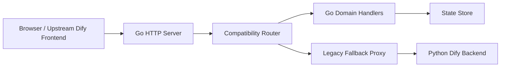

# Dify Go Architecture

本文说明 `dify-go` 的整体架构、设计思路和实现原理。

本仓库基于并致敬 [langgenius/dify](https://github.com/langgenius/dify)。目标不是概念上重新发明一个新产品，而是在尽量保留 Dify 原有产品形态、前端体验和接口契约的前提下，把后端能力逐步迁移到 Go。

## 1. 项目定位

`dify-go` 是一个“兼容优先、按域迁移、双轨运行”的后端迁移工程。

这里的核心不是一次性重写，而是三件事同时成立：

- 前端继续跑
- Go 能逐步接管真实业务状态
- 未迁移能力仍能通过 legacy fallback 保持系统可用

因此它本质上不是“从零开始做一个 Dify-like 产品”，而是“在现有产品之上，逐块把后端主权迁回 Go”。

## 2. 约束条件

这个项目从一开始就接受下面几条硬约束：

### 2.1 前端尽量不动

`web/` 基本直接承接上游前端代码。这样做的意义有三层：

- 迁移风险显著低于“前后端一起重写”
- 前端天然充当最严格的兼容性验收基线
- 我们能把精力集中在后端契约和状态闭环，而不是重复造 UI 和交互

### 2.2 API 外形尽量稳定

Go 后端优先保留上游的：

- 路径前缀
- 字段命名
- 响应结构
- 请求方法与参数习惯

即使内部实现与 Python 原版并不完全相同，对前端和调用方来说也尽量保持“外形不变”。

### 2.3 迁移过程中系统必须一直能跑

这意味着项目不能采用“全部写完再切换”的策略，而必须支持已迁与未迁能力并存。

## 3. 设计目标

### 3.1 兼容优先

第一优先级不是做最理想的内部模型，而是让原有 Dify 前端尽可能无感地工作在 Go 后端之上。

### 3.2 业务域闭环优先

一个功能页面通常依赖一串接口和一份共享状态模型，所以迁移单位应当是业务域，而不是离散接口。

### 3.3 已迁能力必须真正自持状态

一旦某组能力宣称“迁到了 Go”，那它对应的核心状态就应该由 Go 负责读写、持久化和演化，而不是继续依赖 Python 侧做隐式主存储。

### 3.4 明确 fallback 边界

没有迁完的能力可以 fallback，但边界必须清晰可见，不能出现“接口表面在 Go，实际关键语义还散落在别处”的灰区。

## 4. 非目标

当前阶段不把下面这些事当成第一优先级：

- 和 Python 内部实现逐行逐类对齐
- 一开始就引入最终形态的数据库与分布式架构
- 在覆盖率还不高时提前做深度性能优化
- 重做前端视觉和交互

这些并不是永远不做，而是不抢当前主线。

## 5. 核心设计原则

### 5.1 前端兼容优先于内部优雅

如果“内部更优雅的设计”会破坏前端兼容性，那就先选择兼容方案，等覆盖率和回归验证稳定后再收敛内部实现。

### 5.2 先跑通主链路，再补边角语义

很多域的第一阶段实现都先满足：

- 页面能打开
- 列表能展示
- 核心 CRUD 可用
- 关键动作能闭环

然后再逐步把真实语义、失败回滚、外部系统集成等细节往上补。

### 5.3 状态模型先于存储选型

迁移早期最重要的是把“这个域到底有哪些状态、如何演化、由谁拥有”说清楚。至于最终放 JSON 文件、关系库还是事件流，这是下一层问题。

### 5.4 兼容层不是临时脚手架，而是架构层

`internal/server` 的意义不只是“转发请求”，它承担的是：

- 对外 API 契约
- 前端兼容翻译
- 迁移边界控制
- legacy fallback 分流

也就是说，这一层本身就是系统架构的一部分。

## 6. 总体架构



落到仓库结构里：

- `cmd/dify-server`
  服务启动入口，保持足够薄，只负责装配。
- `internal/config`
  管理运行配置、路径、cookie、安全参数、legacy 地址。
- `internal/server`
  路由、中间件、认证、响应兼容、fallback 分流。
- `internal/state`
  已迁业务域的状态模型和持久化实现。
- `web/`
  复用上游前端。

## 7. 模块职责

### 7.1 `cmd/dify-server`

职责：

- 读取配置
- 初始化 store、session、legacy proxy
- 创建 HTTP handler
- 启动服务

这里刻意保持薄入口，是为了让未来更容易替换存储、注入测试依赖或做多种启动模式。

### 7.2 `internal/server`

这是整个项目的契约层和兼容层核心。

主要职责：

- 注册已迁路由
- 提供认证、中间件、CORS、CSRF、防伪头
- 把前端期待的数据结构编码出来
- 在未迁移路径上回退到 legacy backend

它的设计思路是“对外稳定，对内可以持续演化”。

### 7.3 `internal/state`

这是 Go 侧的领域状态层。当前已经承载：

- setup / user / workspace
- app / workflow / workflow runtime
- workspace model providers
- workspace tools / endpoints / triggers
- workspace plugins
- dataset 第一批主链路状态

这层的设计目标不是“最终最完美的数据层”，而是“让每一块已迁业务都有明确定义的状态所有权”。

## 8. 请求处理原理

一个已经迁移的 console 请求，大致会经过下面过程：

1. 浏览器调用 `/console/api/...`
2. Go router 命中对应子路由
3. 中间件完成版本头、CORS、认证和 CSRF 校验
4. handler 解析参数，装配当前用户与工作区上下文
5. handler 调用 `internal/state` 进行状态读写
6. server 层把领域对象映射成前端兼容 JSON

一个未迁移的请求则是：

1. 浏览器调用原路径
2. Go router 未命中已迁 handler
3. `compatFallback` 接管请求
4. 请求被转发到 legacy Python backend
5. Python 返回结果给前端

这个双轨流程就是整个迁移方案能够连续交付的基础。

## 9. 路由边界设计

当前 Go 侧保留 Dify 既有的入口分层：

- `/console/api`
  控制台、创作、配置、管理类能力
- `/api`
  公共运行时接口
- `/trigger`
  trigger builder / subscription / endpoint 的外部入口
- `/files`、`/inner/api`、`/mcp`
  保持前缀存在，为后续迁移或 fallback 留出空间

这里的关键原理是：先稳定“外部轮廓”，再逐步替换“内部器官”。

## 10. 认证与会话设计

当前认证方案由下面几部分组成：

- access token cookie
- refresh token cookie
- in-memory session manager
- cookie + header 的 CSRF 校验

这样设计的原因是：

- 与浏览器控制台形态天然契合
- 实现成本低，迁移起步快
- 能把主要精力放在业务域迁移上

当前的明确边界也很清楚：

- session 重启后不持久
- 多实例部署还不适用

这部分会在工程化加固阶段继续升级。

## 11. 状态存储设计

### 11.1 为什么当前先用 JSON 文件

文件状态对迁移初期非常合适：

- 直观
- 便于调试
- 无需先完成数据库设计
- 适合快速冒烟和回归

这不是最终形态，但非常适合做迁移初期的“真实业务承载层”。

### 11.2 为什么强调状态所有权

如果某个业务域已经迁到 Go，但状态仍主要依赖 Python 侧，那实际上并没有真正完成迁移。真正完成的标志是：

- Go 可以独立读写该域核心状态
- 刷新、重启后状态仍存在
- 不依赖 legacy backend 才能完成主链路

### 11.3 为什么先按域聚合状态

像 tools、plugins、datasets 这种域，其本质不是单个接口，而是一组共享状态与多个页面入口。先把状态归到清晰的域对象上，再围绕它实现接口，是后续收敛复杂度的关键。

## 12. 已迁核心域的设计思路

### 12.1 App / Workflow

这部分已经形成较清晰的 Go 侧建模：

- App 本身的创作态配置
- Workflow draft
- Published versions
- Workflow run / node execution runtime

原理是把“创作态”和“运行态”拆开。因为这两类状态的更新频率、生命周期和查询形态完全不同。

### 12.2 Workspace Model Provider

模型配置被当作 workspace 级能力而不是 app 私有能力，这和前端产品本身的组织方式一致。其设计原理是：

- 多 app 共享同一套模型能力
- provider/credential/model 三层配置天然是工作区级目录
- tools、datasets、agents 后续都可以复用这层能力

### 12.3 Workspace Extension System

Tools、MCP、Endpoints、Triggers 在页面上看似分散，但本质上都属于“工作区扩展系统”。因此 Go 侧把它们统一纳入工作区扩展状态，而不是各写一套分散临时实现。

### 12.4 Plugin Platform

插件平台当前采取的是兼容版 manifest + 持久化安装记录的路线。其设计原理不是完整复刻 plugin daemon，而是先满足前端已经依赖的链路：

- 已安装列表
- 任务轮询
- README / asset / icon
- 安装 / 升级 / 卸载
- 偏好与权限配置

等这些链路都稳定后，再把真实 daemon 语义往里替换。

### 12.5 Workspace Member / Invite Activation

成员域的关键设计点是把“账号”和“邀请”拆开，而不是把 pending invite 直接塞进 user 表示。

当前 Go 侧采用两份状态：

- `Users`
  只表示已经真正可登录、可拿到 session 的账号。
- `WorkspaceInvitations`
  表示还没有激活的邮箱邀请、目标 role 和 activation token。

这样做的原理是：

- 成员页仍然可以直接展示 pending 状态
- 邀请链接校验与激活可以独立闭环
- 未激活邮箱不会污染真实登录用户集合
- 后续接 email register / forgot-password / change-email 时边界更清楚

邀请激活时，Go 会消费 invitation token，把 invitation 转成真实 user，并立即签发 console session cookies；也就是说，这条链路本质上是“状态迁移 + 登录态建立”的组合，而不是单纯的表单提交。

ownership transfer 则继续建立在同一份 workspace membership 状态之上，本质是一次受控的 role mutation。当前 API 已经迁到 Go，并复用持久化 auth flow 保存 pending / verified transfer token；但真正的邮件验证码投递还没有完全迁完，所以能力开关仍保持保守默认值。

### 12.6 Account Auth Flows

Stage 7 的另一条主线是把账号周边的多步认证表单迁到 Go，包括：

- `email-register`
- `email-code-login`
- `forgot-password`
- `account/change-email`
- `account/init`
- `account/education`
- `oauth/provider`

这些能力的共同点不是“字段长得像”，而是都依赖一条短生命周期的多阶段状态机：

- 先发起 send-email / send-code
- 再校验 code 或 token
- 最后提交 reset / register / update

如果一开始就把它们直接耦合进完整邮件系统、数据库表和异步投递链路，Stage 7 的迁移成本会明显膨胀。所以当前 Go 侧先引入了一个独立的 `authFlowManager`，专门维护这类短期 token 状态，并把 flow record 写入同一份 file-backed `StateFile`；而 education 这类“账号附属状态”则直接并入 Go 用户模型，避免再额外引入一套孤立子域。

它的设计原理是：

- 把 register / forgot / change-email 的多步 token 统一抽象成同一类临时 flow record
- 让 email-code-login 这种“验证后立即登录”的一步收口也能复用同一套 token 生命周期
- 允许 token 在 `pending -> verified -> consumed` 之间显式演化
- 让前端现有的多步表单协议保持不变
- 避免过早把“接口迁移”绑死在“真实邮件基础设施必须同时完成”上

`account/init` 虽然不是验证码流程，但它同样属于账号初始化域，所以放在这一批一起迁。当前实现已经把界面语言、时区等初始化状态接到 Go；邀请 code 等更深的账号引导语义后续还可以继续往里补。

`account/education` 的设计思路则是把它当作“附着在 user 上的认证状态”而不是独立复杂服务。当前 Go 侧保存 institution、role、verified_at、expire_at，并同时驱动：

- `/console/api/account/education`
- `/console/api/account/education/verify`
- `/console/api/account/education/autocomplete`
- `/console/api/features` 里的 education feature flag

这样 billing 页面、education apply 页面和账号状态提示就能共享同一份 Go 状态。

`oauth/provider` 和 enterprise SSO 当前也是兼容优先实现。Go 侧先满足 authorize page 所依赖的 app metadata、authorization code 发放、console SSO 登录入口、webapp SSO redirect 和 bearer token 登录状态识别，保证前端页面和基础跳转链路可用；更完整的 token exchange、client registry、外部 IdP metadata/callback、SSO protocol 仍留在后续阶段补齐。

这套方案的边界也很明确：

- 当前 flow manager 已经随 `StateFile` 持久化，但仍不是多实例共享存储
- 邮件验证码仍是兼容占位语义，不是真实投递
- Session manager 仍是进程内存态，服务重启后需要重新登录

因此它更像是 Stage 7 的“契约先行实现”：先把前端依赖的认证链路收回到 Go，再在后续阶段把邮件、共享存储、外部 IdP 协议和安全加固逐步替换进来，而不是把前端重新推回 legacy fallback。

## 13. Dataset 域的设计思路

Dataset 是第四阶段的核心业务域之一，也是当前刚开始推进的新域。

### 13.1 为什么 dataset 要单独成域

因为它不是“文档上传接口集合”，而是一整套完整业务：

- dataset 自身元数据
- 文档列表与文档详情
- indexing 状态
- retrieval 配置
- hit testing 记录
- metadata / segments / external knowledge / pipeline 连接关系

这些状态强关联，不适合拆成零散接口单独迁。

### 13.2 当前 dataset 迁移策略

当前 Go 侧先落第一批主链路：

- dataset 列表、创建、详情、更新、删除
- 文档列表、详情、索引状态和基础批量动作
- process rule、indexing estimate 的兼容实现
- hit testing 与 testing records
- use-check、related apps、dataset service API 的基础接口

其原理是先让知识库页面具备“看得见、建得出、点得进、能做基础操作”的能力，再继续补 metadata、segments、external knowledge、pipeline execution log 等更深层链路。

### 13.3 为什么 dataset 文档先用兼容型语义

当前 document create / indexing / hit testing 还不是完整的生产语义，而是兼容优先的领域模型：

- 文档创建后即可持久化为 Go 侧状态
- 索引状态先用简化生命周期表达
- hit testing 先走轻量检索与记录落库

这样做的收益是：

- 页面先脱离“完全未迁”状态
- 后续可在不改前端的情况下逐步增强真实语义
- RAG pipeline 的后续迁移有了可复用的数据底座

### 13.4 RAG pipeline 与 dataset / workflow 的共享状态

RAG pipeline 在 Go 侧不是一套孤立接口，而是 dataset 与 workflow app 的组合视图：

- dataset 保存知识库元数据、文档、索引状态和 pipeline execution log
- workflow app 保存 draft / published graph、节点运行结果和 workflow run history
- pipeline API 负责把 `pipelineId` 解析到底层 workflow app，再把 linked dataset 的状态同步进去

这条边界让 create-from-pipeline 的页面可以继续沿用上游前端逻辑：选择 datasource 时写入 datasource node last-run，变量检查面板从同一个 node outputs 派生 inspect vars，正式 published run 再把 datasource / processing inputs 落到 dataset document 和 workflow run history。

它的设计原则是“同一个业务事实只落一份 Go 状态”。例如 knowledge-index 节点里的 chunk / retrieval / embedding 配置会同步回 linked dataset；publish / copy / delete 这类 app 生命周期也会同步影响 pipeline dataset。这样 pipeline editor、dataset detail、document processing 页面和 tracing panel 不会各自维护一套互相漂移的兼容状态。

## 14. 为什么坚持“前端不动”

这是整个项目最关键的工程策略之一。

原因不是偷懒，而是因为：

- 上游前端已经沉淀了复杂且成熟的产品逻辑
- 若前后端同时改动，很难定位兼容问题到底出在哪里
- 保留前端不动，相当于一直拥有一个真实用户视角的回归基线

因此这里迁的是“后端实现权”，不是“产品外观”。

## 15. 为什么按业务域迁，而不是按接口零敲碎打

按接口逐个补通常会出现三个问题：

- 页面仍打不开，因为依赖的接口没成组补齐
- 状态模型分散，后续返工很多
- 很难定义“这一块到底算不算迁完”

按业务域推进则更自然：

- 一个页面链路更容易闭环
- 一组接口共用同一份领域状态
- 可以形成明确的阶段性交付与验证

## 16. 测试与验收原则

当前阶段的推荐验证方式分三层：

### 16.1 编译验证

每轮改动后先跑：

```bash
go build ./...
```

### 16.2 路由冒烟验证

对已迁域做最小但完整的 HTTP 验证，例如：

- setup / login
- 列表 / 创建 / 更新 / 删除
- 关键行为型接口

### 16.3 前端流程验证

真正的验收不是某个接口 200，而是对应页面能否完成真实操作、并且不再依赖 fallback 才能完成主流程。

## 17. 后续演进方向

随着迁移覆盖率提高，架构会继续朝下面几个方向演化：

- 把高频写域从文件状态逐步演进到更稳的持久化方案
- 让 session 具备重启恢复和多实例共享能力
- 为已迁域增加更系统的集成测试
- 基于 `docs/route-manifest.json` 持续追踪覆盖率
- 持续收缩 `DIFY_GO_LEGACY_API_BASE_URL` 的依赖面

## 18. 一句话总结

`dify-go` 的架构原理可以概括成一句话：

在不破坏原有 Dify 产品外形的前提下，用一个兼容优先、状态自持、可双轨运行的 Go 后端，逐步把业务主链路从 Python 迁移出来。
