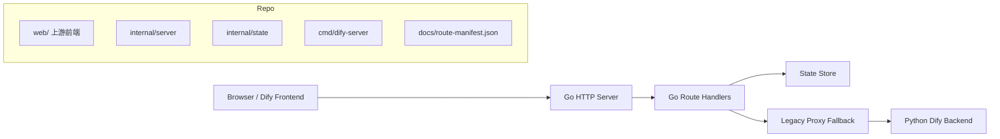

# Dify Go Architecture

这个文档说明 `dify-go` 的整体架构、设计思路和实现原则。

本仓库基于并致敬 [langgenius/dify](https://github.com/langgenius/dify)。这里的目标不是概念上重新发明一套 Dify，而是在尽量保持原有产品形态和前端体验的前提下，把后端能力逐步迁移到 Go。

## 1. 项目定位

`dify-go` 是一个“增量式后端迁移项目”。

核心思路是：

- 尽量保留上游 Dify 前端不变。
- 尽量保留现有 HTTP API 前缀和数据结构。
- 按业务域把后端能力逐步迁到 Go。
- 对未迁移的路由，临时转发到 Python legacy backend。

这样做的好处是：风险比全量重写低，推进节奏可控，而且每一轮都能形成可运行成果。

## 2. 设计目标

## 2.1 前端兼容优先

前端已经承载了大量产品逻辑、交互流程和接口约定。如果在迁移后端的同时还重写前端，风险会成倍放大。

因此 `dify-go` 把“前端兼容”作为第一约束：

- 保留 `/console/api` 和 `/api` 路径体系。
- 尽量保留字段名和响应结构。
- 尽量让前端无感切换到 Go 后端。
- 优先做兼容层，而不是让前端跟着后端一起改。

## 2.2 按业务域增量迁移

像 Dify 这种成熟产品，不适合一次性整体迁移。更合理的方式是按业务域推进，比如：

- 初始化与认证
- 应用管理
- Workflow 编辑与运行时
- Workspace 级模型提供商
- Tools、Plugins、Triggers
- Datasets 与 RAG Pipeline
- Public Runtime API

每一块都可以独立实现、独立验证、独立交付。

## 2.3 先可用，再优化

当前阶段的第一目标不是做一套最完美的内部实现，而是先让这组能力在 Go 里稳定可用。

所以现阶段允许：

- 用文件状态存储先顶起来
- 用内存 session 先跑起来
- 在不破坏前端的前提下返回简化但兼容的响应

这是有意识的迁移策略，不是偷懒。

## 2.4 明确 fallback，而不是“半残缺上线”

对未迁移能力，与其返回 404 或行为不完整，不如明确走 legacy backend。

这就是 `DIFY_GO_LEGACY_API_BASE_URL` 存在的意义：

- 保证系统可持续运行
- 让迁移工作可以分批交付
- 让“哪些已经迁完、哪些还没迁完”边界清晰

## 3. 非目标

当前阶段以下事项不是第一优先级：

- 立即做到与 Python 内部实现逐行对齐
- 一开始就上最强的持久化架构
- 在路由覆盖率还不够时过早做深度性能优化
- 重做前端或重设计交互

这些事以后会做，但现在不该抢占主线。

## 4. 总体架构



落到仓库里就是：

- `web/` 保留上游前端代码
- `cmd/dify-server` 负责启动服务
- `internal/server` 负责路由、兼容层、认证、中间件、handler
- `internal/state` 负责已迁移业务域的状态
- 未迁移请求通过 proxy 转发到 legacy backend

## 5. 模块划分

## 5.1 `cmd/dify-server`

这是可执行入口。

职责很简单：

- 读取配置
- 创建 HTTP handler
- 启动服务

入口层保持很薄，方便后续替换和测试。

## 5.2 `internal/config`

负责集中管理运行配置，例如：

- 监听地址
- 状态文件路径
- 上传目录
- cookie 配置
- 前端允许来源
- legacy backend 地址

配置集中管理的意义在于：迁移过程里环境切换会很多，统一入口更安全。

## 5.3 `internal/server`

这是整个项目的兼容层核心。

职责包括：

- 路由注册
- 中间件
- 请求解析与响应编码
- 认证与 session 校验
- 把前端期待的行为映射到当前 Go 实现
- 在必要时回退到 legacy backend

可以把它理解成“对外 API 契约层”。

## 5.4 `internal/state`

这是已迁移业务域的状态承载层。

目前主要负责：

- bootstrap 状态
- 用户与工作区
- 应用
- API Key
- workflow draft/version/runtime
- workspace model provider 配置
- workspace tool provider、workflow tool、custom API tool、MCP provider 配置

在迁移阶段，明确的状态模型比“最终形态的存储架构”更重要。

## 5.5 Workspace 扩展能力状态

第二阶段开始后，`internal/state` 里的 `Workspace` 不再只保存 model settings，还会把工作区级扩展能力放到独立的 `tool_settings` 里。

当前已经落地的子域包括：

- built-in tool provider 凭证状态
- custom API tool provider 定义与 schema
- workflow as tool provider 定义
- MCP provider 配置、授权状态和已同步工具列表

这样做有两个直接收益：

- `tool-providers`、`tools/*` 这类聚合接口可以完全由 Go 侧自举，不再依赖 Python 查询工作区扩展状态。
- workflow tool 和 MCP 这类前端强依赖“列表 + 详情 + CRUD + 授权状态”的能力，能够围绕同一份工作区状态做一致读写。

## 6. 请求处理流程

一个已经迁移的 console 请求，大致经历下面流程：

1. 浏览器调用 `/console/api/...`
2. Go router 命中已迁移路由
3. 中间件执行 CORS、版本头、认证、CSRF 校验
4. handler 加载当前用户和工作区上下文
5. handler 读取或修改 `internal/state`
6. 返回前端兼容的 JSON

一个未迁移的请求，则会走：

1. 浏览器调用 `/console/api/...` 或 `/api/...`
2. Go router 没有匹配到迁移 handler
3. `compatFallback` 接管请求
4. 请求被转发到 Python legacy backend
5. Python 返回结果给前端

这个双轨结构，就是整个迁移方案的基础。

## 7. 路由设计原则

服务端故意沿用 Dify 原有的 API 分层。

## 7.1 `/console/api`

面向控制台、配置和创作侧。

例如：

- setup/login
- account profile
- workspace 配置
- apps
- workflows
- model providers

## 7.2 `/api`

面向运行时和终端用户访问面。

例如：

- login status
- chat/completion runtime
- conversations
- public workflow execution

## 7.3 兼容保留前缀

像 `/files`、`/inner/api`、`/mcp`、`/trigger` 这类前缀，即使暂时没完全迁，也会先挂载出来，方便：

- 后续逐步补 Go 实现
- 或者平滑转发到 legacy backend

这样系统的外部形状是稳定的。

## 8. 状态存储设计

## 8.1 为什么先用文件状态

当前 `dify-go` 对已迁业务域使用文件型 JSON 状态存储。

原因很现实：

- 迭代快
- 调试直观
- 不需要先引入完整数据库方案
- 便于冒烟测试和问题定位

它不是最终解，但非常适合迁移初期。

## 8.2 为什么“已迁业务域”必须在 Go 里自持状态

只要一组路由被认为已经迁移，Go 后端就应该真正拥有它对应的状态。

这样做的好处：

- 行为更可预测
- 测试更容易
- 减少和 legacy backend 的隐式耦合
- 让每个迁移阶段边界清楚

## 8.3 当前状态方案的限制

文件状态方案当前也有明确限制：

- 高频写入场景不够理想
- 随着业务域增多，并发和一致性要更谨慎
- 跨业务域关联最终会需要更强的存储模型

这些都是真问题，但应该在迁移覆盖率起来之后再系统解决。

## 8.4 工作区扩展状态为什么单独建模

Tools、workflow-as-tool、MCP、agent strategy 这些能力表面上是不同页面，实质上都属于“工作区级扩展目录”。

这批能力有几个共同点：

- 前端会先拉 provider 列表，再按类型拉 tools，再进入单 provider 详情页。
- 大多数页面同时依赖“配置状态”和“可消费的工具定义”。
- 它们都更适合先做工作区本地状态聚合，再逐步替换成真实后端实现。

所以当前 Go 侧没有把这些接口拆成彼此完全独立的临时实现，而是先统一落到 `Workspace.ToolSettings` 这层，再由 `internal/server/workspace_tools.go` 负责把状态转换成前端期待的数据结构。

## 9. 认证与 Session 设计

当前认证方案主要由下面几部分组成：

- cookie access token
- cookie refresh token
- 内存 session manager
- cookie + header 的 CSRF 保护

为什么这样设计：

- 它和浏览器前端天然契合
- 实现简单、行为清晰
- 能把迁移重点放在业务能力，而不是先做一整套账号基础设施

为什么它还不是终态：

- 服务重启后 session 不持久
- 多实例部署需要共享 session 存储

所以这部分应该在后面的“工程化加固”阶段继续演进。

## 10. Workflow 运行时设计

Workflow 子系统是当前迁移思路最典型的例子之一。

Go 侧已经显式建模了：

- workflow draft
- published versions
- workflow run history
- node execution history
- version restore 和 metadata update

这里的核心设计原则是：

“把 workflow 创作态和运行态分开建模。”

原因：

- draft 是高频修改对象，应该可变
- published version 需要稳定 ID 和历史
- run/node execution 更像追加型运行记录

这种拆分能让后续日志、暂停、RAG pipeline 复用 runtime 基础更自然。

## 11. Model Provider 设计

Workspace Model Provider 已经被作为一个独立工作区域迁移出来。

目前包含：

- provider catalog
- supported model types
- default model
- provider credential
- model credential
- model enable/disable
- load balancing 配置

这里的核心设计原则是：

“模型可用性首先是 workspace 级能力，而不是 app 私有能力。”

原因：

- 多个 app 会共享同一工作区的模型配置
- 前端本身就是按 workspace 维度访问 model provider API
- 这能减少后续 tools、datasets、agents 侧对模型依赖时的重复配置

## 12. 为什么坚持不动前端

这是整个项目最关键的策略之一。

原因：

- Dify 前端已经编码了大量成熟产品逻辑
- 如果迁后端时同步改前端，会掩盖后端兼容问题
- 保持前端不动，相当于拥有一个天然的兼容性测试标准

只要原前端能继续跑，就说明迁移方向基本是对的。

这也是对上游产品设计的一种尊重：这里迁的是后端实现，不是无必要地重造整套交互层。

## 13. 为什么按业务域迁，而不是按接口零散补

看起来“一个接口一个接口迁”更安全，但实际常常会得到一个前端打不开、状态不闭环、测试困难的系统。

按业务域迁移更合理，因为：

- 一组页面通常依赖一串相邻接口
- 相邻接口通常共享状态模型
- 测试时可以按功能闭环验证，而不是只看单个接口返回 200

例如：

- 应用日志和会话详情应该一起迁
- tools、endpoints、triggers 适合一起迁
- datasets 和 RAG pipeline 适合分前后两批但连续推进

这样返工更少。

## 14. 兼容层设计哲学

`dify-go` 的兼容层遵循一个很务实的原则：

先满足前端契约，再优化内部实现。

具体表现为：

- 某些字段先返回简化版本，但结构必须兼容
- 某些路由同时兼容多个 HTTP method，只要前端当前在使用
- 某些页面依赖的元数据可以先生成占位但前端可消费的内容

这不是妥协式开发，而是迁移工程里最有效率的策略之一。

## 15. 测试策略

当前阶段建议保持三层验证。

## 15.1 编译验证

每次改动后都先跑：

```bash
go build ./...
```

这是最基本的完整性校验。

## 15.2 路由冒烟测试

对每个已迁业务域：

- 启一个临时端口的 Go 服务
- 用 `curl` 或脚本跑 setup/login
- 验证这组路由最关键的 GET/POST/PATCH/DELETE

这是目前最快的验证方式。

## 15.3 前端行为验证

一组路由迁完以后，还要回到对应前端页面确认：

- 页面能打开
- 关键操作能完成
- 不再依赖 fallback backend

真正的验收标准不是“接口返回 200”，而是“页面和流程真的能跑”。

## 16. 后续演进方向

随着迁移覆盖率提高，架构应该继续演进。

## 16.1 更强的持久化方案

后续可以逐步把高价值、高写入业务域迁到更稳的存储：

- 关系型数据库
- append-oriented runtime records
- 更好的并发控制

## 16.2 更可靠的 Session 存储

Session 最终应该具备：

- 重启可恢复
- 多实例可共享

## 16.3 路由覆盖率追踪

`docs/route-manifest.json` 应该持续作为路由库存，用来追踪：

- 已迁哪些业务域
- 剩余哪些高价值接口
- fallback 面积还剩多少

## 16.4 最终缩小并移除 Legacy Fallback

长期目标不是永远双轨运行，而是：

- 先把 fallback 面积收缩到很小
- 再让已支持能力集完全脱离 Python backend

## 17. 总结

`dify-go` 的架构思路，可以概括为一句话：

“外部契约尽量稳定，内部能力逐步换血。”

保守的地方：

- 保留前端
- 保留 API 形状
- 按业务域渐进迁移

激进的地方：

- 已迁能力必须真正由 Go 接管
- 兼容层必须显式、可验证
- legacy 依赖要一步一步缩小

这套方法的核心价值，不是一次性做完所有事，而是让迁移过程始终保持可运行、可验证、可继续推进。
